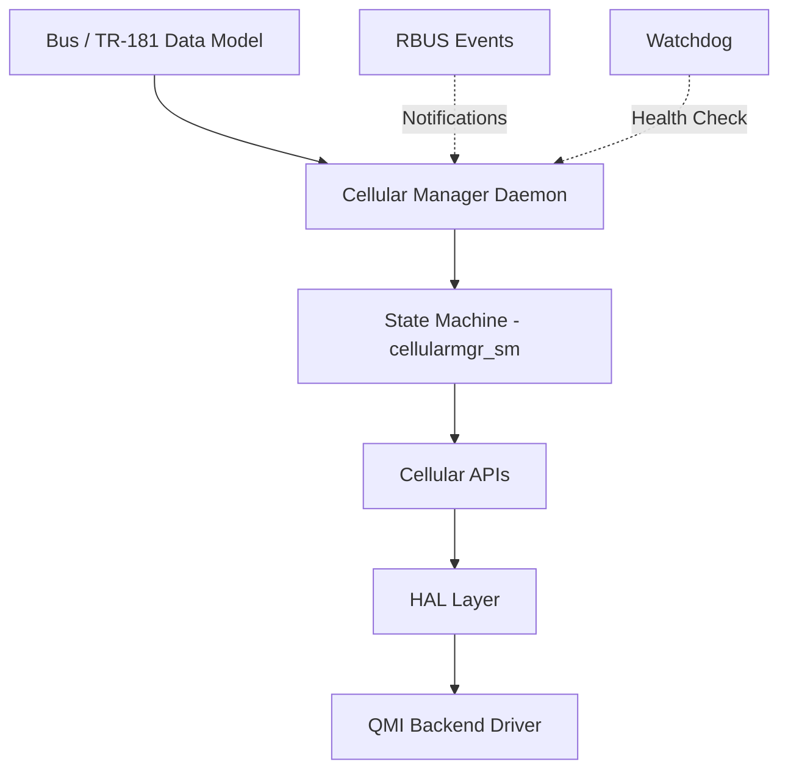

# Cellular Manager

[](../LICENSE)
[](https://en.wikipedia.org/wiki/C_(programming_language))
[](https://www.yoctoproject.org/)

An RDK cellular modem management daemon for LTE/4G/5G connectivity on embedded devices.

## Overview

Cellular Manager (`cellularmanager`) manages the full modem lifecycle — device detection, SIM validation, network registration, data session establishment, and IP provisioning — on resource-constrained embedded Linux devices.

### Key Features

- **State Machine Driven**: 6-state policy controller (DOWN → DEACTIVATED → DEREGISTERED → REGISTERED → CONNECTED → ERROR)
- **QMI Backend**: libqmi-glib integration for Qualcomm modem control (DMS, NAS, WDS, UIM)
- **TR-181 Data Model**: Full CCSP/RBUS parameter exposure for remote management
- **WAN Integration**: IP provisioning and forwarding via WAN Manager

### Architecture

```
┌────────────────────────────────────────────────────┐
│                  cellularmanager                │
│  ┌──────────┐  ┌───────────┐  ┌────────────────┐  │
│  │ State    │  │ Cellular  │  │ Bus Utils      │  │
│  │ Machine  │──│ APIs      │──│ (RBUS/CCSP)    │  │
│  └──────────┘  └───────────┘  └────────────────┘  │
│       │              │                             │
│  ┌──────────┐  ┌───────────┐                       │
│  │ HAL      │──│ QMI APIs  │                       │
│  └──────────┘  └───────────┘                       │
└────────────────────────────────────────────────────┘
         │                    │
    /dev/cdc-wdm0        WAN Manager
```

## Quick Start

### Build

```bash
./autogen.sh
./configure
make
```

### Run

```bash
systemctl start RdkCellularManager
```

### Unit Tests

```bash
make -C source/test
source/test/run_ut.sh
```

## Documentation

See [docs/README.md](../docs/README.md) for the full documentation index:

| Document | Content |
|----------|---------|
| [Architecture](../docs/architecture.md) | System design, state machine, threading, dependencies |
| [Workflows](../docs/workflows.md) | Modem bring-up, registration, data session flows |
| [Troubleshooting](../docs/troubleshooting.md) | Decision trees, log signatures, RCA workflow |
| [Developer Playbook](../docs/developer-playbook.md) | Shell commands for debugging and validation |
| [Getting Started](../docs/onboarding.md) | 30-minute onboarding for new engineers |
| [HAL API](../docs/reference/hal-api.md) | HAL function signatures and contracts |
| [Callbacks](../docs/reference/callbacks.md) | Callback families, ordering, side effects |
| [TR-181 Matrix](../docs/reference/tr181-matrix.md) | Parameter-to-code ownership map |

## Project Structure

```
cellular-manager/
├── source/
│   ├── CellularManager/    # Core daemon (SM, HAL, QMI, APIs, bus utils)
│   ├── TR-181/             # Data model handlers
│   └── test/               # Unit tests (gtest/gmock)
├── docs/                   # Documentation
├── config/                 # XML configuration
├── systemd_units/          # Service files
└── .github/                # AI tooling, instructions, skills
```

## Build Flags

| Flag | Effect |
|------|--------|
| `CELLULAR_MGR_LITE` | Minimal mode — no QMI, no state machine |
| `QMI_SUPPORT` | Enable QMI backend (auto on non-lite) |
| `LTE_USB_FEATURE_ENABLED` | USB modem interface (`usb0` vs `wwan0`) |
| `RBUS_BUILD_FLAG_ENABLE` | RBUS event publication |
| `WAN_MANAGER_UNIFICATION_ENABLED` | Unified WAN Manager DML paths |

## Contributing

See [CONTRIBUTING.md](../CONTRIBUTING.md) for guidelines.

## License

Apache License 2.0 — see [LICENSE](../LICENSE).
### Architecture Highlights



## Quick Start

### Prerequisites

- GCC 4.8+ or Clang 3.5+
- pthread library
- libqmi-glib and glib-2.0 (QMI backend runtime)
- Autotools (autoconf, automake, libtool)

### Build

```bash
# Clone repository
git clone https://github.com/rdkcentral/cellular-manager.git
cd cellular-manager

# Configure
autoreconf -i
./configure

# Build
make

# Install
sudo make install
```

### Docker Development

Refer to the provided Docker container for a consistent development environment:

https://github.com/rdkcentral/docker-device-mgt-service-test

## Documentation

📚 **Agentic Development Framework**

### Key Documents

- **[Agentic Dev README](AGENTIC_DEV_README.md)** — Full guide to AI-assisted development, agents, skills, and workflows
- **[Documentation Guide](DOCUMENTATION_GUIDE.md)** — Writing standards for playbooks and triage artifacts
- **[Copilot Instructions](copilot-instructions.md)** — Always-on project constraints
- **[Runtime Docs Hub](../docs/README.md)** — Architecture, workflows, troubleshooting, and API references

### Agents

- **[Embedded C Expert](agents/embedded-c-expert.agent.md)** — Modem C development specialist
- **[Embedded C Expert](agents/embedded-c-expert.agent.md)** — Modem C development specialist
- **[Legacy Refactor Specialist](agents/legacy-refactor-specialist.agent.md)** — Safe legacy code cleanup
- **[Cellular Manager Agent](agents/cellular-manager-agent.md)** — Comprehensive AI agent for debugging, triage, RCA, and development

### Skills

- **[Code Review](skills/code-review/SKILL.md)** — PR analysis with regression risk scoring
- **[Triage Logs](skills/triage-logs/SKILL.md)** — Device log correlation and RCA
- **[Incident RCA](skills/incident-rca/SKILL.md)** — Confidence-scored RCA with hypothesis/disproof workflow
- **[Memory Safety Analyzer](skills/memory-safety-analyzer/SKILL.md)** — Leak and lifetime analysis
- **[Thread Safety Analyzer](skills/thread-safety-analyzer/SKILL.md)** — Race and deadlock detection
- **[Platform Portability Checker](skills/platform-portability-checker/SKILL.md)** — Cross-platform verification
- **[Quality Checker](skills/quality-checker/SKILL.md)** — Container-based quality gate
- **[Technical Documentation Writer](skills/technical-documentation-writer/SKILL.md)** — Consistent doc generation

### Knowledge Base

- **[Signal Metrics & Error Codes](knowledge/signal-metrics-error-codes.md)** — Enums, thresholds, timeouts, build flags, log signatures
- **[Failure Patterns](knowledge/failure-patterns.md)** — Known failure modes, state machine stuck patterns, thread safety, memory patterns

### Prompt Templates

- **[Debugging Session](prompts/debugging-session.prompt.md)** — Structured interactive debugging workflow
- **[Root Cause Analysis](prompts/root-cause-analysis.prompt.md)** — Formal RCA with hypothesis scoring and disproof
- **[Incident Triage Prompt](prompts/incident-triage.prompt.md)** — Structured incident diagnosis output
- **[New Feature Design Prompt](prompts/new-feature-design.prompt.md)** — Design-first change proposals with safety and test impact

### Playbooks

- **[Issue Triage Playbook](playbooks/issue-triage-playbook.md)** — First-responder triage with state-based diagnosis
- **[Recovery Workflows](playbooks/recovery-workflows.md)** — Step-by-step recovery for common failure scenarios

### Instructions (File-Scoped)

- **[C Embedded](instructions/c-embedded.instructions.md)** — Applies to `**/*.c`, `**/*.h`
- **[C++ Testing](instructions/cpp-testing.instructions.md)** — Applies to `source/test/**/*.cpp`
- **[Shell Scripts](instructions/shell-scripts.instructions.md)** — Applies to `**/*.sh`
- **[Build System](instructions/build-system.instructions.md)** — Applies to `**/Makefile.am`, `**/configure.ac`

## Project Structure

```
cellular-manager/
├── source/                   # Source code
│   ├── CellularManager/     # Main daemon + HAL
│   ├── TR-181/              # Data model plugin
│   └── test/                # Unit tests (gtest/gmock)
├── config/                   # Runtime configuration
├── systemd_units/           # Service definitions
└── .github/                 # Agentic AI framework (this directory)
```

## Primary Workflows Supported

- Modem bring-up and SIM validation
- LTE/5G network registration and attach failures
- QMI command/response troubleshooting
- AT command debugging as platform-level supplemental diagnostics
- APN/PDP context and data session recovery
- RF signal metric interpretation (RSRP, RSRQ, SINR, CQI)
- Watchdog, crash dump, and restart-loop diagnosis
- firmware mode/reset and version mismatch investigations
- Power-save mode and modem sleep debugging

## Development

### Running Tests

```bash
# Unit tests
make check

# Run under valgrind
valgrind --leak-check=full ./source/test/cellularmgr_gtest
```

### CI Workflows

- **[L1 Unit Tests](workflows/L1-tests.yml)** — Runs on every PR to develop
- **[Native Build](workflows/native-build.yml)** — Build verification
- **[CLA](workflows/cla.yml)** — Contributor license agreement check
- **[FossID](workflows/fossid_integration_stateless_diffscan_target_repo.yml)** — License compliance scan

## Contributing

To improve the agentic system:

1. **Add new agents** — Create `.agent.md` in `agents/`
2. **Add new skills** — Create `SKILL.md` in `skills/<name>/`
3. **Extend instructions** — Update language files in `instructions/`
4. **Add pitfalls** — Update `skills/code-review/references/common-pitfalls.md`

Follow the patterns in existing files and test thoroughly.
