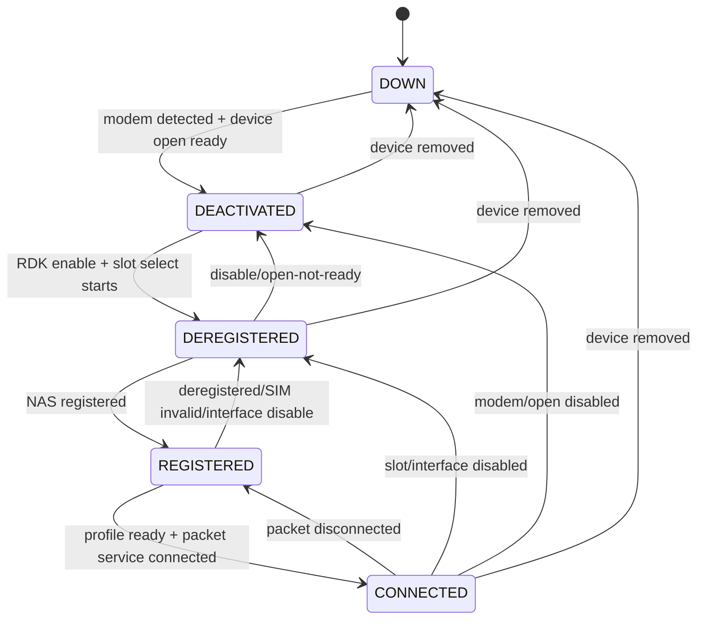

# Cellular Manager Architecture

## 1. System Overview

Cellular Manager is an RDK daemon (`cellularmanager`) managing the full lifecycle of an LTE/4G/5G cellular modem on embedded CPE devices. It bridges the hardware modem (via QMI), the RDK control plane (CCSP/RBUS/TR-181), and WAN data-plane orchestration.

```
┌─────────────────────────────────────────────────────────────┐
│                    RDK Management Layer                      │
│  ┌──────────┐  ┌───────────┐  ┌──────────┐  ┌───────────┐  │
│  │ TR-181   │  │ WAN Mgr   │  │  PSM DB  │  │   RBUS    │  │
│  │ ACS/SNMP │  │           │  │          │  │Subscribers│  │
│  └────┬─────┘  └─────┬─────┘  └────┬─────┘  └─────┬─────┘  │
└───────┼──────────────┼─────────────┼──────────────┼─────────┘
        │              │             │              │
┌───────┼──────────────┼─────────────┼──────────────┼─────────┐
│  ┌────▼──────────────▼─────────────▼──────────────▼─────┐   │
│  │              Cellular Manager Daemon                  │   │
│  │  ┌──────────┐ ┌──────────┐ ┌──────────┐ ┌─────────┐ │   │
│  │  │   DML    │ │  State   │ │ Cellular │ │  Bus    │ │   │
│  │  │ TR-181   │ │ Machine  │ │   APIs   │ │  Utils  │ │   │
│  │  └────┬─────┘ └────┬─────┘ └────┬─────┘ └────┬────┘ │   │
│  │       └────────────┼────────────┘            │       │   │
│  │            ┌───────▼────────┐                │       │   │
│  │            │   HAL Layer    │                │       │   │
│  │            └───────┬────────┘                │       │   │
│  │            ┌───────▼────────┐                │       │   │
│  │            │  QMI Backend   │                │       │   │
│  │            │  libqmi-glib   │                │       │   │
│  └────────────┴───────┬────────┘────────────────┘       │   │
└───────────────────────┼─────────────────────────────────┘   │
                        ▼                                      │
               ┌──────────────────┐                            │
               │  Cellular Modem  │                            │
               │  /dev/cdc-wdm0   │                            │
               └──────────────────┘                            │
```

## 2. Components

| Component | Files | Purpose |
|-----------|-------|---------|
| **Process Bootstrap (SSP)** | `cellularmgr_main.c`, `cellularmgr_ssp_action.c` | Daemonize, signal handling, CCSP bus init, component registration |
| **State Machine** | `cellularmgr_sm.c/h` | Policy-driven lifecycle: DOWN→DEACTIVATED→DEREGISTERED→REGISTERED→CONNECTED |
| **HAL Abstraction** | `cellular_hal.c/h` | Thin dispatch; `#ifdef QMI_SUPPORT` forwards to QMI backend |
| **QMI Backend** | `cellular_hal_qmi_apis.c/h` | libqmi-glib over `/dev/cdc-wdm0` — DMS/NAS/WDS/UIM services |
| **DML / TR-181** | `cellularmgr_cellular_apis.c/h`, `cellularmgr_cellular_internal.c/h`, `TR-181/middle_layer_src/*` | `Device.Cellular.*` object lifecycle and get/set APIs |
| **Bus & WAN Utils** | `cellularmgr_bus_utils.c/h` | CCSP bus wrappers, WAN Manager parameter propagation, sysevent |
| **RBUS Events** | `cellularmgr_rbus_events.c/h` (TR-181 layer) | Periodic signal/cell/status publication (`RBUS_BUILD_FLAG_ENABLE`) |

## 3. Initialization Sequence

1. `main()` → parse args → optional daemonize → signal handlers (`SIGTERM`, `SIGINT`, `SIGSEGV`)
2. `[SR213]` drop_root_caps / update_process_caps
3. `CellularMgr_MessageBus_Init()` → CCSP bus
4. `CellularMgr_Init()` → component interfaces → `CellularMgr_RegisterComponent()` → DML handlers
5. DML init: allocate `CELLULAR_DML_INFO`, read syscfg `cellularmgr_enable`, parse `/etc/partners_defaults.json`
6. `cellular_hal_init()` → QMI device open state machine
7. `CellularMgr_Start_State_Machine` (non-lite) → dedicated SM thread
8. RBUS monitor thread (when `RBUS_BUILD_FLAG_ENABLE`)

## 4. State Machine

### 4.1 States

| State | Value | Meaning |
|-------|-------|---------|
| `CELLULAR_STATE_DOWN` | 1 | Modem not detected/removed |
| `CELLULAR_STATE_DEACTIVATED` | 2 | Modem detected, QMI open in progress |
| `CELLULAR_STATE_DEREGISTERED` | 3 | Device open, SIM selection, NAS pending |
| `CELLULAR_STATE_REGISTERED` | 4 | NAS registered, profile/network setup |
| `CELLULAR_STATE_CONNECTED` | 5 | Data session active |
| `CELLULAR_STATUS_ERROR` | 6 | Fatal error, SM thread exits |

### 4.2 Transition Model



### 4.3 Loop Mechanics

- Thread: `CellularMgr_StateMachine_Thread`
- Cadence: 500ms `select()` (`LOOP_TIMEOUT`)
- On change: logs transition, calls `CellularMgrSMCheckAndSetWWANConnectionStatus()`, optionally publishes RBUS

### 4.4 Key State Functions

| State | Entry Function | Action |
|-------|---------------|--------|
| DOWN | `StateDown()` | Polls `cellular_hal_IsModemDevicePresent()`; on detect → `TransitionDeactivated()` |
| DEACTIVATED | `StateDeactivated()` | Checks enable + modem mode + open status; → `TransitionDeregistered()` |
| DEREGISTERED | `StateDeregistered()` | `TransitionRegistering()` starts NAS monitor; on registered → parse MCCMNC → init default profile from `partners_defaults.json` |
| REGISTERED | `StateRegistered()` | `TransitionRegistered()` creates profile; `TransitionRegisteredStartNetwork()` starts IPv4/IPv6; profile status `CREATED` → `exit(0)` for restart |
| CONNECTED | `StateConnected()` | Health checks; any failure → `TransitionConnectedStopNetwork()` |

### 4.5 Callback Handlers

| Callback | Trigger | Key Updates |
|----------|---------|-------------|
| `CellularMgrDeviceRemovedStatusCBForSM` | Device removal | `enDeviceDetectionStatus`, `enDeviceOpenStatus` |
| `CellularMgrDeviceOpenStatusCBForSM` | QMI open complete | `enDeviceOpenStatus`, `acDeviceName`, `bModemMode`; sets `rx_urb_size=1500` |
| `CellularMgrDeviceSlotStatusCBForSM` | SIM slot done | `enDeviceSlotSelectionStatus`, `SelectedSlotNumber` |
| `CellularMgrDeviceRegistrationStatusCBForSM` | NAS change | `enDeviceNASRegisterStatus`, `enDeviceNASRoamingStatus`, `enRegisteredService` (**mutex**) |
| `CellularMgrProfileStatusCBForSM` | Profile ready | `enDeviceProfileSelectionStatus`, `enPDPTypeForSelectedProfile` |
| `CellularMgrIPReadyCBForSM` | IP assigned | Stores IP info → sysevents → WAN Phy/Link → `SendIPToWanMgr` → forwarding |
| `CellularMgrPacketServiceStatusCBForSM` | Packet status | `enNetworkIPvXPacketServiceStatus` (**mutex**) |

## 5. Data Flow

### Control (Northbound → Southbound)

```
TR-181 Set → CCSP DML Handler → Cellular API → HAL → QMI Backend → libqmi → Modem
```

### Events (Southbound → Northbound)

```
Modem QMI Indication → QMI Async Callback → SM Callback → SM State Transition
  → WAN Manager Update + RBUS Event + DML Status Update
```

### IP Provisioning

```
PacketService Connected → CellularMgrPacketServiceStatusCBForSM
  → CellularMgrIPReadyCBForSM
    → Configure wwan0 (ifconfig/ip)
    → Set sysevents (cellular_wan_v4_*, cellular_wan_v6_*)
    → Update WAN Manager Phy.Status + Link.Status
    → Send IP to WAN Manager (CellularMgr_Util_SendIPToWanMgr)
    → Enable forwarding + flush conntrack
```

## 6. Threading Model

| Thread | Created By | Purpose |
|--------|-----------|---------|
| Main | `main()` | Process lifecycle, sleep loop |
| State Machine | `CellularMgr_Start_State_Machine()` | Policy transitions |
| QMI GLib Loop | HAL init | Async QMI transactions + indications |
| RBUS Monitor | DML init (RBUS builds) | Periodic signal/cell publication |

### Synchronization

- **Mutex in `cellularmgr_sm.c`** protects: `enDeviceNASRegisterStatus`, `enDeviceNASRoamingStatus`, `enRegisteredService`, `enNetworkIPvXPacketServiceStatus`
- **QMI mutex/cond** for network scan orchestration
- **Unprotected** (known): `enDeviceOpenStatus`, `enDeviceSlotSelectionStatus` — callbacks write, SM reads without lock

## 7. QMI Backend Detail

### Device Open State Machine

```
MODEM_OPEN_STATE_BEGIN → DEVICE_OPEN → DMS_OPEN → GET_REVISION →
GET_VERSION → GET_IMEI → GET_MANUFACTURER → GET_OPERATING_MODE →
WDS_OPEN → GET_CAPABILITIES → NAS_OPEN → NAS_REGISTER_SIGNAL_INDICATIONS →
NAS_NETWORK_SCAN_INIT → NAS_CELL_LOCATION_INFO → NOTIFY(READY) → END
```

### HAL Function Categories

| Category | Functions | QMI Service |
|----------|-----------|-------------|
| Device | `IsModemDevicePresent`, `open_device` | DMS |
| SIM/UICC | `select_device_slot`, `get_uicc_slot_info`, `get_active_card_status` | UIM |
| Registration | `monitor_device_registration`, `set_modem_network_attach/detach` | NAS |
| Profile | `profile_create/delete/modify`, `get_profile_list` | WDS |
| Network | `start_network`, `stop_network` | WDS |
| Signal/Cell | `get_signal_info`, `get_cell_location_info` | NAS |
| Device Info | `get_device_imei`, `get_modem_vendor`, `get_modem_firmware_version` | DMS |
| Config | `set_modem_operating_configuration` | DMS |

## 8. External Dependencies

| Dependency | Interface | Failure Impact |
|-----------|-----------|----------------|
| **QMI Modem** (`/dev/cdc-wdm0`) | libqmi-glib | SM stuck in DOWN |
| **libqmi-glib** | Shared library | Build failure / runtime crash |
| **WAN Manager** | CCSP Bus get/set | Cellular IP not propagated |
| **CCSP Bus / CR** | D-Bus / CCSP API | Component registration fails |
| **PSM Database** | CCSP PSM API | Persistence lost |
| **RBUS** (optional) | RBUS publish | Status events not delivered |
| **syscfg** | `syscfg_get/set` | Enable flag lost across reboots |
| **sysevent** | `sysevent_set` | WAN metadata not propagated |
| **partners_defaults.json** | File I/O (cJSON) | Empty APN, profile creation may fail |
| **Linux Kernel** | sysctl, ip, conntrack | Interface/forwarding misconfigured |
| **systemd** | Service unit | No auto-restart on crash |
| **libsecure_wrapper** | `v_secure_system()` | System commands blocked |
| **libcap** | Capability API | Privilege drop fails (SR213) |

### Dependency Recovery Matrix

| Dependency | Recoverable? | Mechanism |
|-----------|-------------|-----------|
| Modem removed | Yes | SM polls `stat()` every 500ms |
| Modem offline | Yes | Re-open on return |
| WAN Manager down | Partial | Errors logged, retry next cycle |
| CCSP Bus down | No | Requires process restart |
| PSM unavailable | Yes | Defaults used |
| SIM invalid/removed | Yes | SM waits for valid SIM |
| partners_defaults.json missing | Partial | Profile uses empty fields |

## 9. Build Flags

| Flag | Effect |
|------|--------|
| `CELLULAR_MGR_LITE` | No QMI, no state machine, minimal HAL |
| `QMI_SUPPORT` | Enables QMI backend (auto in non-lite) |
| `LTE_USB_FEATURE_ENABLED` | Interface = `usb0`; skips wwan0 config |
| `RBUS_BUILD_FLAG_ENABLE` | Enables RBUS event publication |
| `WAN_MANAGER_UNIFICATION_ENABLED` | Different WAN Manager DML paths |
| `_SR213_PRODUCT_REQ_` | Privilege dropping, modem mode control |
| `RDK_SPEEDTEST_LTE` | Adds `X_RDK_SpeedTest_Enable` parameter |
| `_WNXL11BWL_PRODUCT_REQ_` | Platform-specific modem firmware HAL |

## 10. System Boundaries

**Owns:** Modem detection/open, SIM/UICC, NAS registration, APN/PDP lifecycle, data session start/stop, IP→WAN Manager propagation, signal polling, TR-181 `Device.Cellular.*`, state machine policy.

**Does NOT own:** WAN failover (WAN Manager), DHCP (WAN Manager), firewall rules, DNS resolution, routing policy, modem firmware updates.

## 11. Error Handling & Recovery

| Condition | From State | Recovery |
|-----------|-----------|---------|
| Device removed | Any | → DOWN |
| Open not ready | CONNECTED/REGISTERED/DEREGISTERED | → DEACTIVATED |
| SIM invalid / slot not ready | REGISTERED/CONNECTED | → DEREGISTERED |
| NAS deregistered | CONNECTED/REGISTERED | → DEREGISTERED |
| Packet disconnected | CONNECTED | Stop network → REGISTERED+ |
| Interface disabled | REGISTERED/CONNECTED | → DEREGISTERED |

Recovery is **state-driven** (not exponential retry). SM re-evaluates every 500ms and promotes/demotes based on callback-updated flags.

## 12. Security

- Signal handlers attempt controlled modem teardown
- `_SR213_PRODUCT_REQ_` enables capability dropping via `libcap` + `libsecure_wrapper`
- Sensitive data (IMSI/ICCID) should be masked in logs
- CCSP identity: `com.cisco.spvtg.ccsp.cellularmanager`
