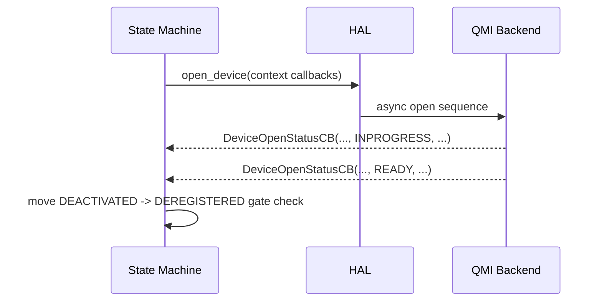
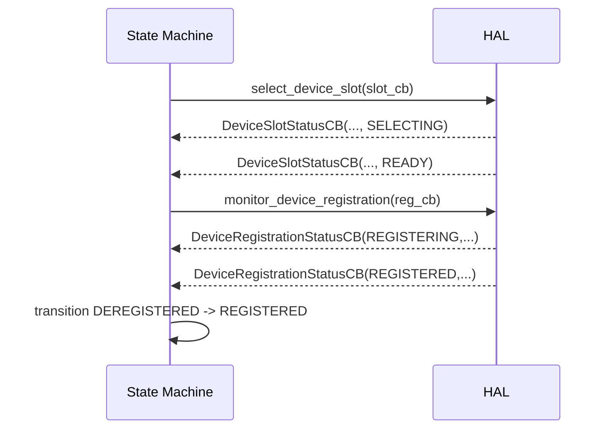
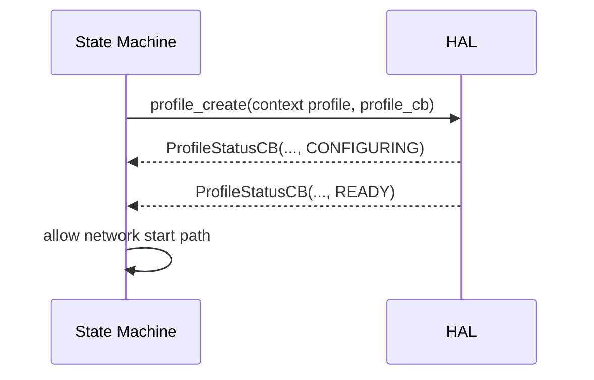
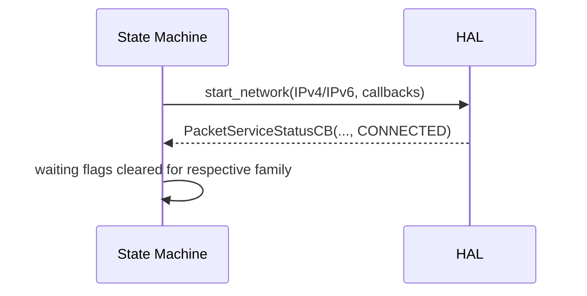
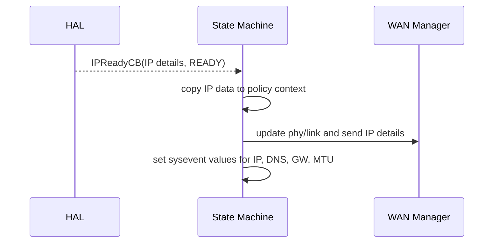

# Callback Lifecycle Sequence Catalog

This catalog documents critical callback sequences that drive Cellular Manager behavior.

## Why This Exists

- Callback timing and ordering govern state transitions.
- Most field regressions are callback-related rather than pure function logic issues.
- This reference gives reviewers and incident responders a deterministic sequence baseline.

## Callback Families

1. Device detection and open callbacks
2. Slot and registration callbacks
3. Profile status callbacks
4. Packet service callbacks
5. IP-ready callbacks
6. Device management action threads

## 1) Device Detect and Open Sequence

### Primary callbacks

- CellularMgrDeviceRemovedStatusCBForSM
- CellularMgrDeviceOpenStatusCBForSM

### Expected sequence

### Key side effects

- device name and WAN interface captured in policy context
- modem mode flag updated
- rx_urb_size tuning applied on ready path for wwan0

### Failure signatures

- repeated DEACTIVATED with no READY callback
- callback called with invalid params
- sm controller object is empty

## 2) Slot Selection and Registration Sequence

### Primary callbacks

- CellularMgrDeviceSlotStatusCBForSM
- CellularMgrDeviceRegistrationStatusCBForSM

### Expected sequence

### Key side effects

- selected slot number and readiness tracked
- roaming and registered service type updated
- MCCMNC bootstrap path triggered post-registration

### Edge cases

- register to not-registered transition remapped to registering state in callback logic
- SIM status checks can keep state in DEREGISTERED despite registration events

## 3) Profile Selection and Creation Sequence

### Primary callback

- CellularMgrProfileStatusCBForSM

### Expected sequence

### Special branch

If profile status is CREATED in registered state flow, process restart branch is executed to reconcile default profile initialization.

### Failure signatures

- profile remains CONFIGURING indefinitely
- restart loop on repeated CREATED path

## 4) Packet Service Status Sequence

### Primary callback

- CellularMgrPacketServiceStatusCBForSM

### Expected sequence

### Dual-stack requirement

For IPv4_OR_IPV6 profile type, CONNECTED state requires both families connected.

### Failure signatures

- one family connected while other remains disconnected
- connected state oscillation followed by stop_network branch

## 5) IP-Ready Callback Sequence

### Primary callback

- CellularMgrIPReadyCBForSM

### Expected sequence

### Key side effects

- packet waiting flags reset on not-ready events
- sysevent propagation for v4/v6 keys
- WAN manager path updates via bus utilities

### Failure signatures

- IP-ready logged but WAN manager update fails
- link reported up with missing DNS/gateway propagation

## 6) Device Management Async Action Threads

### Typical actions

- factory reset action
- reboot device action

### Behavior

- thread created for action execution
- HAL operation invoked
- process restart/reinit may follow based on path and return status

### Failure signatures

- thread creation failure logs
- operation returns error and exits path early

## Callback Ordering Invariants

1. Do not assume packet status arrives after IP-ready in all paths.
2. State transitions must tolerate callback reordering and delayed callbacks.
3. Context validity checks are mandatory for every callback path.
4. Connected state should only be entered after required packet-family conditions are met.

## Reviewer Checklist for Callback Changes

- [ ] callback input validation retained
- [ ] shared context updates synchronized where required
- [ ] waiting/in-progress flags are consistent for all branches
- [ ] error and transition logs remain specific and grep-friendly
- [ ] disconnect and teardown callbacks cannot leave stale link-up state

## Related References

- docs/workflows.md
- docs/troubleshooting.md (log signatures & RCA workflow)
- docs/reference/tr181-ownership-matrix.md
