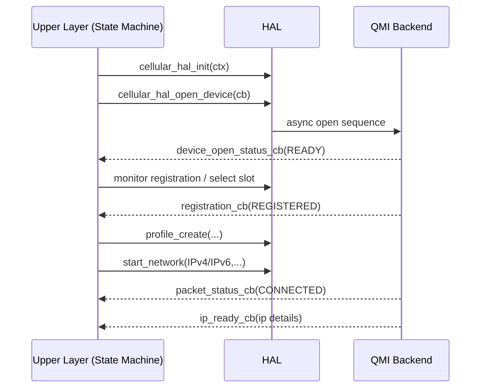

# Cellular HAL API Reference

This document describes the public HAL surface consumed by Cellular Manager upper layers.
Reference headers:

- `source/CellularManager/cellular_hal.h`
- `source/CellularManager/cellular_hal_qmi_apis.h`

## 1. Return Conventions

- `RETURN_OK` = `0`
- `RETURN_ERROR` = `-1`

Most APIs return `int` status and use output structures for data payload.

## 2. Core Types

## 2.1 Profile and Context

### `CellularProfileStruct`

Fields include:

- `ProfileID`, `ProfileType`, `PDPContextNumber`
- `PDPType` (`IPV4`, `IPV6`, `IPV4_OR_IPV6`)
- `PDPAuthentication` (`NONE`, `PAP`, `CHAP`)
- `PDPNetworkConfig`
- `ProfileName`, `APN`, `Username`, `Password`, `Proxy`, `ProxyPort`
- roaming/default/disable booleans

### `CellularContextInitInputStruct`

- `enIPFamilyPreference`
- `stIfInput` (`CellularProfileStruct`)
- `enPreferenceTechnology`

## 2.2 IP and Packet Stats

### `CellularIPStruct`

- `WANIFName`, `IPAddress`, `IPType`
- `SubnetMask`, `DefaultGateWay`
- `DNSServer1`, `DNSServer2`, `Domains`
- `MTUSize`

### `CellularPacketStatsStruct`

- bytes/packets sent/received
- drop counters
- up/downstream max bitrate

## 2.3 Device and Network State Enums

- Device detection: `DEVICE_DETECTED`, `DEVICE_REMOVED`
- Device open: `NOT_READY`, `INPROGRESS`, `READY`
- Slot status: `NOT_READY`, `SELECTING`, `READY`
- NAS status: `NOT_REGISTERED`, `REGISTERING`, `REGISTERED`
- Roaming: `ROAMING_OFF`, `ROAMING_ON`
- IP ready: `NOT_READY`, `READY`
- Packet service: `DISCONNECTED`, `CONNECTED`

## 2.4 Callback Structures

### Device lifecycle callbacks

- device remove status callback
- device open status callback
- slot status callback
- registration status callback

### Network callbacks

- packet service status callback
- IP-ready callback

These callbacks are passed to async HAL operations and are used heavily by `cellularmgr_sm.c`.

## 3. Initialization and Device Control APIs

## 3.1 `cellular_hal_init(CellularContextInitInputStruct *input)`

Initializes HAL backend context and async runtime.

**Used during** DML/component startup.

**Behavior**:

- stores context defaults
- initializes QMI backend (when enabled)
- starts backend async machinery

## 3.2 `cellular_hal_open_device(CellularDeviceContextCBStruct *cb)`

Starts modem open sequence and registers open/remove callbacks.

**Async behavior**:

- callback eventually reports `DEVICE_OPEN_STATUS_READY` or failure path

## 3.3 `cellular_hal_IsModemDevicePresent(void)`

Checks modem presence (device node and backend availability checks).

## 3.4 `cellular_hal_IsModemControlInterfaceOpened(void)`

Returns whether control interface is currently opened and usable.

## 3.5 `cellular_hal_set_modem_operating_configuration(CellularModemOperatingConfiguration_t mode)`

Controls modem operational mode:

- online
- offline
- low power
- reset
- factory reset

## 4. Profile Management APIs

## 4.1 `cellular_hal_profile_create(CellularProfileStruct *profile, cellular_device_profile_status_api_callback cb)`

Creates/selects profile in modem backend.

## 4.2 `cellular_hal_profile_modify(...)`

Modifies existing profile parameters.

## 4.3 `cellular_hal_profile_delete(...)`

Deletes profile and updates callback status.

## 4.4 `cellular_hal_get_profile_list(...)`

Retrieves profile collection for DML/access-point mapping.

## 5. Registration and SIM/UICC APIs

## 5.1 `cellular_hal_monitor_device_registration(cellular_device_registration_status_callback cb)`

Registers registration monitor callback for NAS attach/detach transitions.

## 5.2 `cellular_hal_select_device_slot(cellular_device_slot_status_api_callback cb)`

Selects active SIM slot and reports status via callback.

## 5.3 `cellular_hal_get_active_card_status(CELLULAR_INTERFACE_SIM_STATUS *status)`

Returns active SIM health:

- valid
- blocked
- error
- empty

## 5.4 UICC Data APIs

Representative APIs include retrieval of:

- number of UICC slots
- slot details
- ICCID/MSISDN
- SIM power enable/disable

## 6. Data Session APIs

## 6.1 `cellular_hal_start_network(CellularNetworkIPType_t family, CellularProfileStruct *profile, CellularNetworkCBStruct *cb)`

Starts packet data session for IPv4/IPv6.

**State-machine usage**:

- called in `TransitionRegisteredStartNetwork()`
- sets in-progress and waiting flags
- completion indicated through packet/IP callbacks

## 6.2 `cellular_hal_stop_network(CellularNetworkIPType_t family)`

Stops packet session for specified family.

**State-machine usage**:

- called during disconnect/teardown in `TransitionConnectedStopNetwork()`

## 6.3 `cellular_hal_get_current_pdp_context_status_information(...)`

Provides status and IP family information for context profile exposure.

## 7. Signal, Cell, and Network Information APIs

## 7.1 `cellular_hal_get_signal_info(CellularSignalInfoStruct *info)`

Returns signal metrics:

- RSSI
- RSRP
- RSRQ
- SNR
- TX power

## 7.2 `cellular_hal_get_cell_location_info(CellLocationInfoStruct *info)`

Returns cell identifiers and band-related details.

## 7.3 `cellular_hal_get_cell_information(...)`

Returns serving and neighboring cell records (operator, RAT, RF metrics).

## 7.4 `cellular_hal_get_current_plmn_information(CellularCurrentPlmnInfoStruct *plmn)`

Returns operator registration details (MCC/MNC, service, roaming).

## 7.5 `cellular_hal_get_available_networks_information(...)`

Returns scanned available network/operator list.

## 8. Statistics and Interface APIs

## 8.1 `cellular_hal_get_packet_statistics(CellularPacketStatsStruct *stats)`

Fetches traffic statistics used by DML stats nodes.

## 8.2 `cellular_hal_get_current_modem_interface_status(CellularInterfaceStatus_t *status)`

Provides current interface-level status (`IF_UP`, `IF_DOWN`, `IF_DORMANT`, etc).

## 9. Radio Technology APIs

Representative functions include:

- set preferred radio technology
- get preferred radio technology
- get current radio technology
- get supported radio technologies

These APIs back TR-181 and diagnostics operations.

## 10. Error Handling Contract

Common expected caller pattern:

```c
CellularSignalInfoStruct info = {0};
int rc = cellular_hal_get_signal_info(&info);
if (rc != RETURN_OK) {
    CcspTraceError(("signal retrieval failed rc=%d\n", rc));
    return RETURN_ERROR;
}
```

Guidance:

1. always validate input pointers before call
2. treat callbacks as asynchronous and potentially late
3. preserve backend return code context in logs
4. avoid blocking operations in callback contexts

## 11. Threading Notes for API Consumers

- HAL QMI backend is async and GLib-loop-driven
- callbacks may execute on backend/event threads
- state updates in upper layers should be synchronized
- avoid long blocking actions within callback handlers

## 12. Typical Integration Sequence



## 13. Build-Variant Considerations

API behavior may vary with build flags:

- `CELLULAR_MGR_LITE`
- `QMI_SUPPORT`
- `LTE_USB_FEATURE_ENABLED`
- `RBUS_BUILD_FLAG_ENABLE`

Consumers should account for unavailable backend features in lite/minimal builds.
