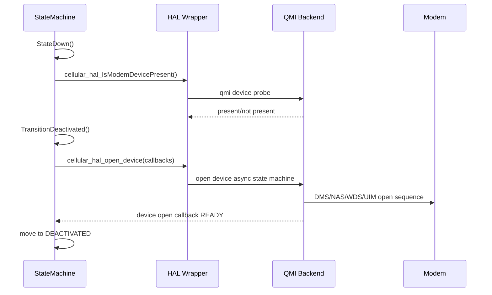
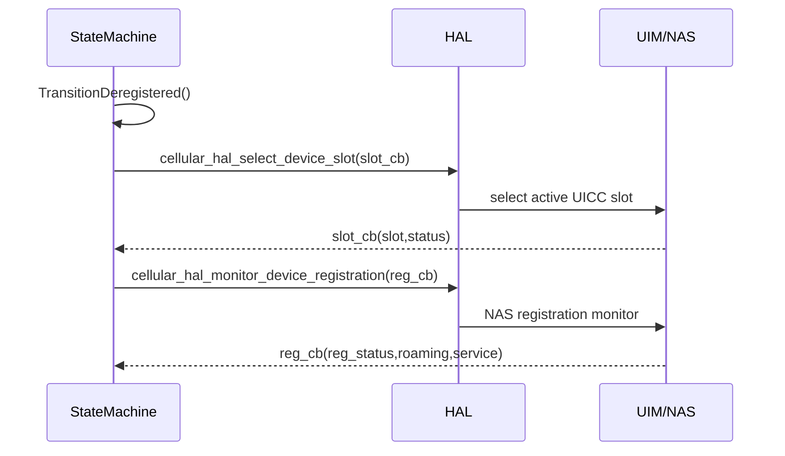

# Cellular Manager Functional Workflows

This document describes implemented runtime workflows derived from the current source code paths in:

- `cellularmgr_sm.c`
- `cellularmgr_cellular_apis.c`
- `cellular_hal.c`
- `cellular_hal_qmi_apis.c`

See [architecture.md](architecture.md) for system design and state machine detail.

## 1. Modem Bring-up Workflow

### Key Conditions

- Bring-up requires modem presence and open status readiness.
- Device callback sets modem mode and interface name in SM context.
- `rx_urb_size` tuning is applied for `wwan0` when device is ready.

## 2. SIM Detection and Slot Selection Workflow

### Observed State Logic

- Slot status progresses: `NOT_READY` → `SELECTING` → `READY`
- Registration status progresses: `NOT_REGISTERED` → `REGISTERING` → `REGISTERED`
- If active SIM status is not valid (`SIM_STATUS_VALID` check fails), SM remains in `DEREGISTERED`.

## 3. Network Registration Workflow

### Trigger

In `StateDeregistered()`, when:

- slot is ready,
- interface enable is true,
- NAS status transitions to registered.

### Operator-Aware Default Profile

After registration succeeds:

1. Read current PLMN (`MCC`, `MNC`)
2. Build `MCCMNC` key
3. Parse `/etc/partners_defaults.json`
4. Initialize HAL context default profile using operator data
5. Populate SM context profile if APN not already configured

## 4. APN/Profile Selection Workflow

When in `REGISTERED` state and profile is not ready:

1. `TransitionRegistered()` sets profile status to configuring
2. Calls `cellular_hal_profile_create()` with selected context profile
3. Callback `CellularMgrProfileStatusCBForSM()` updates:
   - selected profile name
   - PDP type
   - profile status (`CONFIGURING`, `READY`, `CREATED`, etc.)

### Profile-created Restart Behavior

If default profile creation status is `DEVICE_PROFILE_STATUS_CREATED`, code triggers process exit to restart component and reload profile path.

## 5. PDP/Data Session Setup Workflow

When profile is ready and link is eligible, `TransitionRegisteredStartNetwork()` starts network for required IP families.

### IPv4 Path

1. Mark IPv4 start in progress
2. register `device_network_ip_ready_cb` and `packet_service_status_cb`
3. call `cellular_hal_start_network(CELLULAR_NETWORK_IP_FAMILY_IPV4, ...)`
4. wait for packet status + IP ready callback

### IPv6 Path

Same flow with `CELLULAR_NETWORK_IP_FAMILY_IPV6`.

### Dual Stack Path

Both flows run; connected state requires both packet services connected for dual-stack profile type.

## 6. IP Provisioning and WAN Propagation Workflow

When IP ready callback fires (`CellularMgrIPReadyCBForSM`):

1. Persist IPv4/IPv6 info in SM context
2. Set sysevents for:
   - IP address
   - gateway
   - DNS1/DNS2 and nameserver aggregate
   - MTU
3. Update WAN interface phy/link status
4. Send IP lease to WAN Manager (`CellularMgr_Util_SendIPToWanMgr`)
5. Enable forwarding / flush conntrack on certain builds

## 7. Connected-State Health Monitoring

In `StateConnected()` component continuously validates:

- RDK enable still true
- slot still ready
- interface still enabled/upstream
- packet service still connected for required family/families
- device open status still ready

Any failure triggers `TransitionConnectedStopNetwork()` and demotion to a lower stable state.

## 8. Teardown Workflow (Stop Network)

`TransitionConnectedStopNetwork()` performs:

1. bring interface down (platform-specific)
2. flush IPv4/IPv6 addresses
3. disable forwarding
4. flush conntrack
5. set phy/link status down in WAN manager
6. stop active IPv4/IPv6 network sessions
7. reset associated sysevents to default/empty values
8. decide next target state (`DEACTIVATED`, `DEREGISTERED`, or `REGISTERED`) based on current conditions

## 9. Retry and Recovery Behavior

### Recovery Style

Recovery is predominantly state-driven rather than per-call exponential retry.

- repeated state loop evaluations every cycle
- asynchronous callbacks update state flags
- demotion/re-promotion between states used as recovery mechanism

### Timing Controls

- loop cadence via `LOOP_TIMEOUT`
- ad-hoc waits during profile/network bring-up paths (`sleep` + counters)
- packet/network in-progress and waiting flags gate premature transitions

## 10. DFOTA / Firmware and Power-save Workflow Hooks

The HAL API surface supports modem operating configuration controls:

- online
- offline
- low power mode
- reset
- factory reset

These are available through `cellular_hal_set_modem_operating_configuration()` (QMI implementation in backend). Current orchestration is API-driven and can be invoked through upper-layer DML/control paths.

## 11. Crash/Watchdog-Related Runtime Behavior

- process writes init markers under `/tmp/` for crash-check logic
- signal handlers attempt modem stop and then exit
- component may intentionally exit in certain profile creation flows to enforce restart-based reconciliation

## 12. External Event Publishing Workflow

### RBUS (when enabled)

- monitor thread periodically fetches radio and cell metrics
- publishes value changes for subscribed `Device.Cellular.*` topics

### CCSP/TR-181

- DML get/set handlers expose current runtime state and control toggles
- WAN manager interaction occurs through CCSP bus set/get operations

## 13. Failure Transition Matrix

| Condition | Current State | Action |
| --------- | ------------- | ------ |
| Device removed | Any | Transition to `DOWN` |
| Open status not ready | connected/registered/deregistered | Transition to `DEACTIVATED` |
| SIM invalid / slot not ready | registered/connected | Transition to `DEREGISTERED` |
| NAS deregistered | connected/registered | Transition to `DEREGISTERED` |
| Packet service disconnected | connected | Stop network then move to registered/deregistered/deactivated |
| Interface disabled | registered/connected | Transition to `DEREGISTERED` |

## 14. Validation Checkpoints per Workflow

For each workflow stage validate:

1. state machine state value and logs
2. relevant callback status fields in SM context
3. sysevent values for IP metadata
4. WAN manager phy/link status updates
5. TR-181 interface status (`X_RDK_PhyConnectedStatus`, `X_RDK_LinkAvailableStatus`)
6. RBUS publication behavior when subscribed
