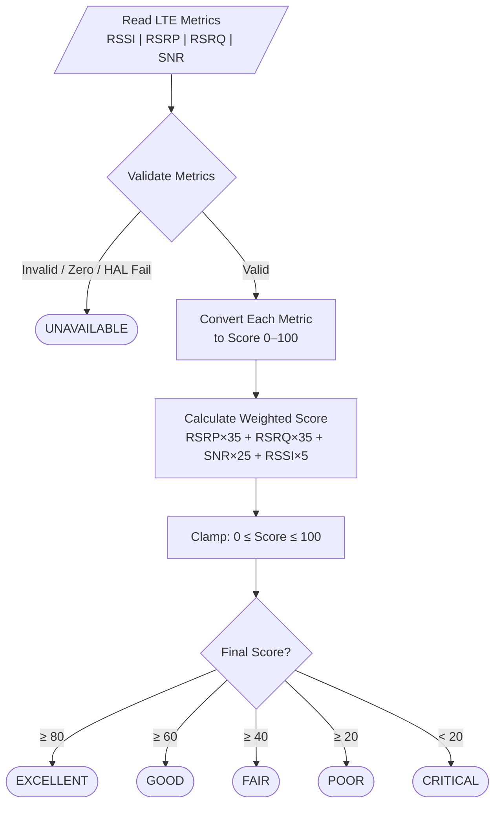

# LTE Radio Environment Classification Algorithm

## Goal

Generate reliable:

```text
Device.Cellular.Interface.1.X_RDK_RadioEnvConditions
```

using LTE radio quality metrics instead of only RSRP.

---

# Input Metrics

| Metric | Unit | Description |
|---|---|---|
| RSSI | dBm | Total received signal strength |
| RSRP | dBm | LTE reference signal received power |
| RSRQ | dB | LTE signal quality |
| SNR | dB | Signal-to-noise ratio |

---

# Output States

```text
EXCELLENT
GOOD
FAIR
POOR
CRITICAL
UNAVAILABLE
```

| State | Meaning |
|---|---|
| EXCELLENT | Strong signal, low interference |
| GOOD | Reliable LTE, moderate load |
| FAIR | Usable but degraded |
| POOR | Weak/congested, high retransmissions |
| CRITICAL | Near radio link failure, unusable |
| UNAVAILABLE | Modem down / deregistered / HAL fail |

---

# Algorithm Flow



---

# Step 1 — Validate Metrics

## Return UNAVAILABLE if:

- HAL failure
- invalid metric range
- modem returns zero values

## Example

```c
if (
    RSRP == 0 ||
    RSSI == 0 ||
    modem_HAL_failure
)
{
    return UNAVAILABLE;
}
```

---

# Metric Validation Ranges

| Metric | Valid Range |
|---|---|
| RSRP | -140 to -40 dBm |
| RSRQ | -30 to 0 dB |
| SNR | -30 to 40 dB |
| RSSI | -120 to -30 dBm |

---

# Step 2 — Convert Metrics To Scores

Each metric is converted into:

```text
0 → 100
```

---

# Option A — Step Tables

Fixed discrete score buckets.

## RSRP Score

| RSRP (dBm) | Score |
|---|---|
| > -85 | 100 |
| -85 to -95 | 80 |
| -95 to -105 | 60 |
| -105 to -115 | 30 |
| < -115 | 10 |

## RSRQ Score

| RSRQ (dB) | Score |
|---|---|
| > -10 | 100 |
| -10 to -12 | 85 |
| -12 to -15 | 70 |
| -15 to -17 | 40 |
| < -17 | 10 |

## SNR Score

| SNR (dB) | Score |
|---|---|
| > 13 | 100 |
| 5 to 13 | 75 |
| 1 to 5 | 50 |
| -3 to 1 | 25 |
| < -3 | 5 |

## RSSI Score

| RSSI (dBm) | Score |
|---|---|
| > -65 | 100 |
| -65 to -75 | 80 |
| -75 to -85 | 60 |
| -85 to -95 | 40 |
| < -95 | 20 |

## Option A — Pros and Cons

| Pros | Cons |
|---|---|
| Simple to implement | Cliff-edge jumps at boundaries |
| Easy to read/debug | Requires recompile to tune |
| Predictable output | Cannot adapt per carrier |

---

# Option B — Linear Interpolation (Dynamic)

Smooth continuous scoring using configurable min/max thresholds.

## Formula

```c
int metric_to_score(int value, int min_val, int max_val)
{
    if (value >= max_val) return 100;
    if (value <= min_val) return 0;
    return ((value - min_val) * 100) / (max_val - min_val);
}
```

## Default Thresholds (Configurable)

| Metric | Min (Score=0) | Max (Score=100) | Rationale |
|---|---|---|---|
| RSRP | -120 dBm | -70 dBm | 3GPP practical range; -80 = industry excellent |
| RSRQ | -20 dB | -5 dB | -20 = 3GPP floor; -5 = practical best |
| SNR | -10 dB | 25 dB | ≤0 = unusable; ≥20 = industry excellent |
| RSSI | -100 dBm | -50 dBm | ≤-95 = connection lost; >-65 = excellent |

## Option B — Pros and Cons

| Pros | Cons |
|---|---|
| Smooth transitions (no cliff edges) | Slightly more complex |
| Runtime tunable via TR-181/syscfg | Requires config storage |
| Per-carrier/network profiles possible | Less intuitive to debug |
| Reduces hysteresis flapping | |
| One function replaces four tables | |

---

# Side-by-Side Comparison (Your Scenario)

Input: RSSI=-70, RSRP=-104, RSRQ=-17, SNR=-1

| Metric | Option A (Steps) | Option B (Linear) |
|---|---|---|
| RSRP=-104 | 60 | 32 |
| RSRQ=-17 | 10 | 20 |
| SNR=-1 | 25 | 25 |
| RSSI=-70 | 80 | 60 |
| **Weighted Score** | **33** | **29** |
| **Condition** | **POOR** | **POOR** |

Both reach POOR.

## Boundary Behavior Example

| Metric Change | Option A | Option B |
|---|---|---|
| RSRP: -94 → -96 | 80 → 60 (20-point step) | 52 → 48 (gradual 4-point drop) |
| RSRQ: -14 → -16 | 70 → 40 (30-point step) | 40 → 27 (gradual 13-point drop) |

---

# Step 3 — Calculate Weighted Radio Score

## Weight Distribution

| Metric | Weight |
|---|---|
| RSRP | 35% |
| RSRQ | 35% |
| SNR | 25% |
| RSSI | 5% |

---

# Weighted Score Formula

```text
RADIO_SCORE =
(
    RSRP_SCORE * 35 +
    RSRQ_SCORE * 35 +
    SNR_SCORE  * 25 +
    RSSI_SCORE * 5
) / 100
```

---

# Why RSRQ And SNR Have Higher Weight

## RSRP
Measures:
- signal strength only

## RSRQ
Measures:
- interference
- congestion
- RF quality

## SNR
Measures:
- actual usability
- noise level
- throughput potential

## RSSI
Least useful LTE metric because it includes:
- noise
- neighboring cells
- interference

---

# Step 4 — Clamp Final Score

```c
if (RADIO_SCORE < 0)
    RADIO_SCORE = 0;

if (RADIO_SCORE > 100)
    RADIO_SCORE = 100;
```

---

# Step 5 — Map Score To Radio Condition

| Final Score | Condition | LTE Reality |
|---|---|---|
| >= 80 | EXCELLENT | Full speed, low latency |
| >= 60 | GOOD | Reliable data and VoLTE |
| >= 40 | FAIR | Usable, higher latency, reduced throughput |
| >= 20 | POOR | Connected but degraded, frequent retransmissions |
| < 20 | CRITICAL | Near radio link failure, failover recommended |

---

# Example Calculation

## Current Algorithm (RSRP-Only)

```text
RSRP = -104

Thresholds:
  > -85        → EXCELLENT
  -85 to -95   → GOOD
  -95 to -105  → FAIR
  -105 to -115 → POOR
  < -115       → UNAVAILABLE

Result: RSRP(-104) falls in -95 to -105 range → FAIR
```

## New Multi-Metric Algorithm

### Input Metrics

```text
RSSI = -70
RSRP = -104
RSRQ = -17
SNR  = -1
```

---

# Individual Scores

| Metric | Value | Score |
|---|---|---|
| RSRP | -104 (between -105 and -95) | 60 |
| RSRQ | -17 (< -15) | 10 |
| SNR | -1 (< 0) | 5 |
| RSSI | -70 (between -75 and -65) | 80 |

---

# Weighted Score

```text
(
    60 * 35 +
    10 * 35 +
     5 * 25 +
    80 * 5
) / 100

= (2100 + 350 + 125 + 400) / 100
= 29.75
≈ 30
```

---

# Final Output

```text
Current Algorithm:  RSRP(-104) → FAIR  (misleading — ignores poor RSRQ/SNR)
New Algorithm:      Score 30   → POOR  (correctly reflects degraded RF quality)
```

---

# Key Advantages Of This Algorithm

- Uses multiple LTE metrics instead of only RSRP
- Detects interference and congestion
- Better reflects real user experience
- More stable than signal-bar approaches
- Avoids false GOOD/FAIR classifications
- Carrier-grade scoring approach
- Easy to tune per operator/network

---